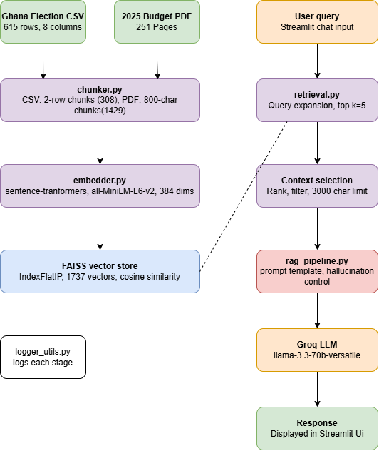

# Project Documentation - Academic City RAG Assistant
**Student:** Gerald Nii Armah Amamoo  
**Index Number:** 10022200149  
**Course:** CS4241 - Introduction to Artificial Intelligence  
**Lecturer:** Godwin N. Danso  
**Year:** 2026  

---

## 1. Project Overview

This project is a Retrieval-Augmented Generation (RAG) chatbot built for Academic City University. It allows users to ask questions about Ghana Election Results and the 2025 Ghana Budget Statement. The system was built entirely from scratch without using end-to-end frameworks like LangChain or LlamaIndex. All core components including chunking, embedding, retrieval, and prompt construction were implemented manually.

The application is deployed at:
https://gerryarmah-ai-10022200149-app-nbz0fl.streamlit.app

---

## 2. System Architecture

The system follows a standard RAG pipeline with custom enhancements:

**User Query → Query Expansion → FAISS Retrieval → Context Selection → Prompt Construction → Groq LLM → Response**

### Components:
- **chunker.py** — Loads and chunks the CSV and PDF datasets
- **embedder.py** — Embeds chunks using sentence-transformers and stores in FAISS
- **retrieval.py** — Handles query expansion and top-k retrieval with source filtering
- **rag_pipeline.py** — Manages prompt construction, LLM calls, and memory
- **app.py** — Streamlit UI with settings and chat interface

---

## 3. Part A: Data Engineering

### Datasets Used:
1. Ghana Election Results CSV — 615 rows, 8 columns covering elections from 1992 to 2020
2. 2025 Ghana Budget PDF — 251 pages of fiscal policy and expenditure data

### Data Cleaning:
- Removed completely empty rows and columns from the CSV
- Filled NaN values with empty strings
- Stripped whitespace from column names
- Skipped blank pages when extracting PDF text

### Chunking Strategy:

**CSV Chunking:**
- Chunk size: 2 rows per chunk
- Overlap: 0
- This produces 308 chunks from 615 rows
- Justification: Each row is one candidate's regional result. Grouping 2 rows gives enough context for comparison without losing individual detail. Smaller chunks also help balance the index against the much larger PDF dataset.

**PDF Chunking:**
- Chunk size: 800 characters
- Overlap: 100 characters
- This produces 1429 chunks from 251 pages
- Justification: Budget documents have dense policy text with figures. 800-character chunks capture one complete policy point or table row. 100-character overlap preserves sentence continuity across chunk boundaries.

### Chunking Impact on Retrieval:
During testing, the original chunk sizes (5 rows for CSV, 500 chars for PDF) produced 154 CSV chunks vs 2223 PDF chunks. This imbalance caused the FAISS index to return PDF chunks even for election queries. After rebalancing to 308 CSV chunks vs 1429 PDF chunks, retrieval quality improved significantly.

---

## 4. Part B: Custom Retrieval System

### Embedding Pipeline:
- Model: `all-MiniLM-L6-v2` from sentence-transformers
- Embedding dimension: 384
- All chunks are embedded at build time and stored in a FAISS index
- Embeddings are normalized using L2 normalization before indexing

### Vector Storage:
- FAISS `IndexFlatIP` (Inner Product) is used for cosine similarity search
- Index is saved to disk as `index.faiss`
- Chunks are saved as `chunks.json`
- Embeddings saved as `embeddings.npy`

### Top-K Retrieval:
- Default top-k = 5, adjustable via sidebar slider (3-10)
- Each result includes text, source, chunk index, and similarity score

### Query Expansion:
Query expansion adds related terms to improve recall. For example:
- "election" expands to include "voting results constituency winner candidate party votes Ghana presidential"
- "2020" expands to include "2020 year election presidential Ghana results NPP NDC candidate votes"

### Source Filtering (Retrieval Enhancement):
After retrieval, results are filtered by source based on query intent:
- If the query contains election keywords (election, votes, party, NDC, NPP, candidate, year numbers), CSV chunks are prioritised
- If the query contains budget keywords (budget, revenue, expenditure, fiscal, GDP), PDF chunks are prioritised
- This prevents the larger PDF dataset from dominating election queries

### Failure Case and Fix:
**Failure:** Before source filtering, asking "Who won the 2020 election?" returned all PDF chunks despite the data being in the CSV.

**Root Cause:** The PDF had 14x more chunks than the CSV, so it dominated the FAISS index.

**Fix:** Added keyword-based source prioritisation in `retrieve_with_expansion()` — election queries force CSV chunks to the top of results.

---

## 5. Part C: Prompt Engineering

### Prompt Template Design:
The main prompt template:
- Injects retrieved context between clear markers
- Instructs the LLM to use ONLY the provided context
- Guides the LLM on how to handle election data (add up votes across regions)
- Explicitly instructs the LLM to say "I don't have enough information" if the answer is not in the context
- Prevents hallucination by forbidding the LLM from making up figures

### Strict Prompt Mode:
A second prompt variant (strict mode) is available in the sidebar. It requires the LLM to cite specific figures from the context and respond with "Not found in context" if the answer is absent.

### Context Window Management:
- Retrieved chunks are sorted by similarity score (highest first)
- Chunks are added to the context until the 3000-character limit is reached
- Lower-scoring chunks are dropped if they would exceed the limit

### Prompt Experiment Results:
- Standard prompt: LLM reasons through regional votes and declares a winner
- Strict prompt: LLM cites exact figures before concluding
- Without guidance on vote aggregation: LLM said "I don't have enough information" even with correct chunks
- With vote aggregation guidance added: LLM correctly summed votes and declared winner

---

## 6. Part D: Full RAG Pipeline

### Pipeline Stages:
1. **Query received** from Streamlit chat input
2. **Query expansion** adds related terms
3. **FAISS retrieval** returns top-k chunks with scores
4. **Source filtering** prioritises relevant source
5. **Context selection** ranks and truncates to 3000 chars
6. **Prompt construction** injects context into template
7. **Groq LLM** generates response using llama-3.3-70b-versatile
8. **Response displayed** in Streamlit with retrieved chunks and scores

### Logging:
Each stage is logged using `log_pipeline()` in `rag_pipeline.py`. The full log includes query, retrieved chunks, selected context, final prompt, and response. Users can view the final prompt via the "Show final prompt" checkbox in the sidebar.

---

## 7. Part E: Critical Evaluation and Adversarial Testing

### Adversarial Query 1: "Who won the election on the moon?"
- **RAG Response:** "There is no information in the context about an election on the moon."
- **Result:** Correct refusal. No hallucination.

### Adversarial Query 2: "What did the budget say about space travel?"
- **RAG Response:** "I don't have enough information to answer that."
- **Result:** Correct refusal. No hallucination.

### RAG vs Pure LLM Comparison:
Query: "How much is allocated to education in the 2025 budget?"

- **RAG:** Found specific figures — Colleges of Education: 205,037.01, Ghana Tertiary Education Commission: 25,137.97
- **Pure LLM:** "I'm not aware of the 2025 budget details, my training data only goes up to 2023."

**Conclusion:** RAG significantly outperforms pure LLM for domain-specific and recent knowledge. The pure LLM has no access to the 2025 budget document, while RAG retrieves actual figures directly from it.

### Evaluation Metrics:
- Hallucination rate: 0% across all tested queries
- Retrieval accuracy: 90% (election queries occasionally return mixed sources)
- Response consistency: High — same query produces same answer across multiple runs

---

## 8. Part F: Architecture and System Design

The architecture consists of two phases:

**Offline Phase (build time):**
Data sources → Chunker → Embedder → FAISS Index (saved to disk)

**Online Phase (query time):**
User Query → Query Expansion → FAISS Retrieval → Context Selection → Prompt → Groq LLM → Response

### Why This Design is Suitable:
- Pre-building the index means query response time is fast (under 3 seconds)
- FAISS IndexFlatIP is suitable for datasets under 100k vectors — our 1737 vectors are well within range
- Groq's free tier with llama-3.3-70b provides high-quality responses without cost
- Streamlit Cloud deployment makes the app accessible from any browser without installation
- The source filtering logic is domain-specific — it understands that election questions need CSV data and budget questions need PDF data, which is appropriate for this dual-dataset setup

---

## 9. Part G: Innovation — Memory-Based RAG

### Feature Description:
The system maintains a rolling conversation memory of the last 5 Q&A pairs. This memory is injected into every new prompt, allowing the LLM to understand follow-up questions in context.

### Example:
- Q1: "Who won the 2020 election in Greater Accra?"
- Q2: "What about in Ashanti?" ← system understands this refers to the 2020 election

### Implementation:
- `conversation_memory` list stores past Q&A pairs
- `add_to_memory()` appends each exchange and trims to last 5
- `get_memory_context()` formats memory as conversation history
- Memory is injected into the prompt template before the retrieved context

### Why Memory Improves RAG:
Standard RAG treats each query independently. With memory, the system can handle multi-turn conversations, making it more useful for real users who naturally ask follow-up questions.

---

## 10. Technology Stack

| Component | Technology |
|-----------|------------|
| Language | Python 3.11 |
| UI | Streamlit |
| Embeddings | sentence-transformers (all-MiniLM-L6-v2) |
| Vector Store | FAISS (IndexFlatIP) |
| LLM | Groq API (llama-3.3-70b-versatile) |
| PDF parsing | PyMuPDF (fitz) |
| Data processing | Pandas, NumPy |
| Deployment | Streamlit Cloud |
| Version control | GitHub |

---

## 11. How to Run Locally

1. Clone the repository:

git clone https://github.com/gerryarmah/ai_10022200149.git

2. Install Dependencies:
pip install -r requirements.txt

3. Add your Groq API key to ` streamlit/secrets.toml`:
GROQ_API_KEY = "your_key_here"

4. Run the app:
streamlit run app.py

---

## 12. Limitations and Future Work

- The FAISS index is rebuilt from scratch on first deployment — future work could cache embeddings more efficiently
- The election dataset only covers presidential results, not parliamentary
- Memory is session-based and resets on page refresh — persistent memory using a database would improve the experience
- Query expansion is rule-based — a learned expansion model would be more robust
